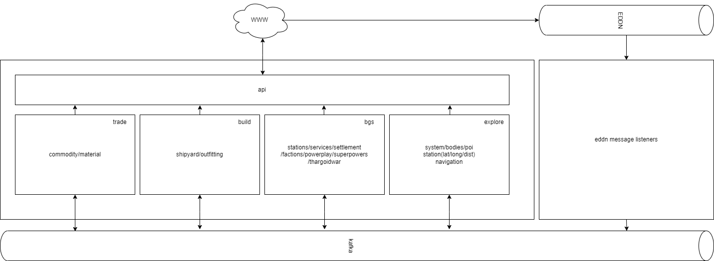

# Modulith

Modules are defined from a player role perspective. Each module is owner of an entity or a partial entity. The overview
below lists which roles/modules are the primary owner for which data and consumes which EDDN messages.
If modules require data that is not supplied in the EDDN messages, it will request this from other modules over kafka.

## Roles
- Trade (Black Market)
    - entities
        - commodity
        - material
    - eddn
        - commodity
        - fcmaterials
- Build
    - entities
        - shipyard/outfitting
        - (engineering)
    - eddn
        - shipyard
        - outfitting
- BGS
    - entities
        - factions/powerplay/superpowers/thargoidwar
        - stations/settlement(services)
    - eddn
        - docked
        - approachsettlement
        - location
        - fsdjump
        - carrierjump (like fsd, but with carrier station data)
- Explore
    - entities
        - System/bodies(composition)
        - station/settlement(lat/long/dist)
        - POI
    - eddn
        - approachsettlement
        - fsdjump
        - carrierjump (like fsd, but with carrier station data)
        - location (at startup, or when being resurrected at a station)
        - codexentry
        - fssallbodiesfound (after having identified all bodies in the system)
        - fssbodysignals (when completing a “Full Spectrum Scan” of a starsystem)
        - fsssignaldiscovered (when zooming in on a signal using the FSS scanner)
        - navbeaconscan (number of bodies in the system)
        - navroute (plotted route [system name,address,pos,starclass])
        - saasignalfound (after using the “Surface Area Analysis” scanner)
        - scanbarycentre (When scanning one body of a binary pair, you will now get an event detailing the
          orbital parameters of their BaryCentre)
        - scan (basic or detailed discovery scan of a star, planet or moon)

## Data request

Modules can request data over kafka. They can do this by specifying which field of which entity they want in a message 
and send it to the owning module. The owning module will answer as soon as it has this data available. This means the
module might need to store the request until it can be fulfilled, although under normal operating conditions the 
response can be given immediately.

With this architecture, modules can become microservices if the need arises and do not require other services to be 
operational to perform their function.

Special care should be taken in determining what data is available to the frontend. Sometimes the missing fields do not
matter, and sometimes they do(fe. coordinates of systems). It should be aligned with the frontend team whether incomplete 
entities should be returned in certain responses. 

# Processors

## approachsettlment-v1.0

### Required

 Color ref for color coding by data-module
- TimeStamp
- Event
- StarSystem
	- name
- StarPos
	- coords
- SystemAddress
	- int??
- Name
	- Settlement Name
- BodyID
- BodyName
- Latitude
- Longitude

## blackmarket-v1.0

### Required

- SystemName
- StationName
- MarketID
- TimeStamp
- Name
    - commodity name
- SellPrice
    - price to sell to market
- Prohibited
    - boolean

## codexentry-v1.0

### Required

- timestamp
- event
    - CodexEntry
- System
    - Name
- StarPos
    - Coords
- SystemAddress
    - int
- EntryID

### Optional
